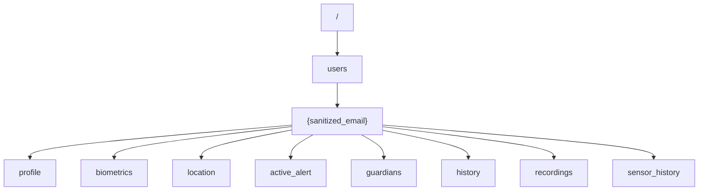

# Firebase Realtime Database Structure for SafeHer

This document outlines the required JSON structure and security rules for the SafeHer Firebase Realtime Database. The app uses a central database to sync biometrics, location, and emergency alerts.

## 1. Security Rules

For testing and initial development, you can use these rules to allow the app to sync data.
> [!CAUTION]
> In a production environment, you should implement proper Firebase Authentication and restrict access so users can only read/write their own data.

```json
{
  "rules": {
    ".read": "now < 1749234600000",  // Example: expires in 30 days
    ".write": "now < 1749234600000",
    "users": {
      "$user_id": {
        ".read": true,
        ".write": true
      }
    }
  }
}
```

---

## 2. JSON Structure

The data is organized under a `users` node. Each user is identified by a sanitized version of their email (e.g., `test@example.com` becomes `test_example_com`).

### Hierarchy Overview


### Detailed Node Definitions

#### `/users/{user_id}/profile`
Stores basic user information.
```json
{
  "name": "Jane Doe",
  "email": "jane@example.com",
  "phone": "+91 9876543210",
  "registeredAt": 1717765200000
}
```

#### `/users/{user_id}/biometrics`
Stores the latest real-time vitals.
```json
{
  "heartRate": 76,
  "spo2": 98,
  "temperature": 36.5,
  "movement": "Walking",
  "lastSync": 1717765300000
}
```

#### `/users/{user_id}/location`
Stores the most recent GPS coordinates.
```json
{
  "latitude": 13.08271,
  "longitude": 80.27072,
  "timestamp": 1717765300000,
  "provider": "GPS"
}
```

#### `/users/{user_id}/active_alert`
Contains info when an emergency is triggered.
```json
{
  "type": "Manual SOS Triggered",
  "threatScore": 95,
  "status": "Active Alert",
  "timestamp": 1717765400000
}
```

#### `/users/{user_id}/sensor_history/{timestamp}`
Historical log of all sensor data (accelerometer, battery, etc.).
```json
{
  "heartRate": 76,
  "spo2": 98,
  "temperature": 36.5,
  "accX": 0.02,
  "accY": 0.98,
  "accZ": 0.01,
  "movement": "Walking",
  "batteryLevel": 89,
  "timestamp": 1717765300000
}
```

#### `/users/{user_id}/guardians`
An array of trusted contacts.
```json
[
  {
    "name": "Mom (Primary)",
    "phone": "+91 9876543210",
    "status": "Active"
  }
]
```

---

## 3. Implementation Note
The app's `FirebaseDbService.kt` uses the **REST API** (`PUT` and `GET` requests) to interact with these nodes. Ensure your Firebase project has the **Realtime Database** enabled in the console.
